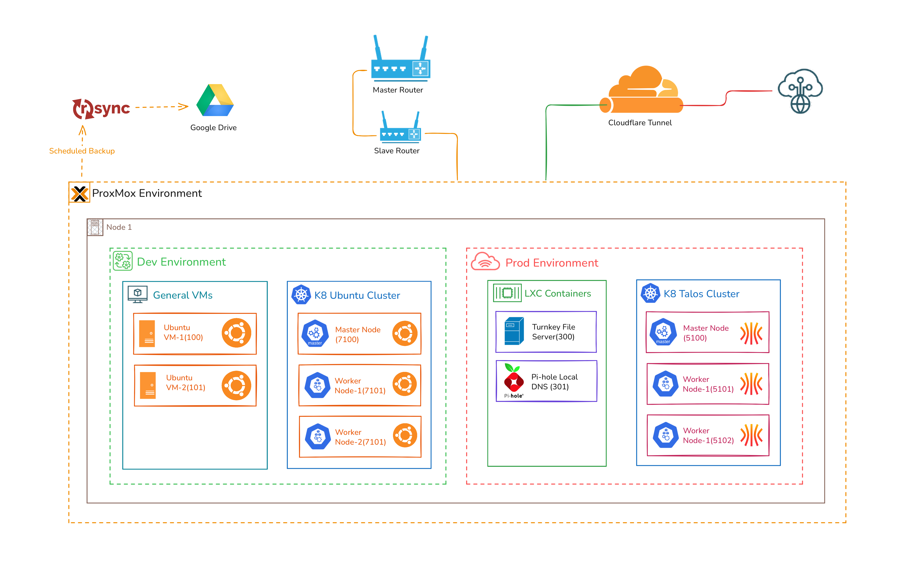

# PH's HomeLab
My Over-Engineered playground, architected with a bare-metal Proxmox infrastructure
provisioned using Terraform (IaC) , hosting segregated Dev/Prod environments with separate
Kubernetes clusters for deployment of projects and continuous experimentation with Cloud, DevOps,
Networking, and Automation.

Established a complete GitOps pipeline with Ansible and ArgoCD for zero-touch infrastructure
configuration and application deployment, enforcing a security-first posture by managing all credentials
through HashiCorp Vault and SOPS encryption.



## [Overview](docs/proxmox.md)
```md
HomeLab/
├── .envrc                           # Dir Env Variables
├── .git/
├── .gitignore
├── .sops.yaml                       # SOPS encryption configuration
├── README.md                        # Repository Main Documentation
├── proxmox/                         # Terraform for Proxmox Infrastructure
│   ├── environments                 # Infrastructure segments
│   │   ├── dev                      # Development Infrastructure
│   │   │   ├── backend.tf           # Development Backend Configuration (Sensetive)
│   │   │   ├── dev.tfvars           # Dev Variables (Sensetive)
│   │   │   ├── main.tf
│   │   │   ├── outputs.tf
│   │   │   ├── variables.tf
│   │   │   └── versions.tf
│   │   └── prod
│   │       ├── backend.tf
│   │       ├── main.tf
│   │       ├── outputs.tf
│   │       ├── prod.tfvars          # Prod Variables (Sensetive)
│   │       ├── variables.tf
│   │       └── versions.tf
│   ├── modules                      # Different Terraform Moudules
│   │   ├── lxc                      # LXC Container Module
│   │   ├── talos-k8s                # Talos Dynamic K8s Cluster Module
│   │   ├── talos-vm                 # Talos VM Module
│   │   ├── ubuntu-k8s               # Ubuntu Dynamic K8s Cluster Module
│   │   └── ubuntu-vm                # Ubuntu VM Module
│   └── readme.md                    # ProxMox Terraform Infra Documentation
├── talos/                             # Talos cluster configs
│   ├── _out                           # All generated config
│   │   ├── encrypt.sh                 # Script to encrypt sensetive configuration files
│   │   ├── decrypt.sh                 # Script to decrypt sensetive configuration files
│   │   └── ...                        # Generated configuration files
│   ├── patches                        # Patches for Controlplane and Workers
│   ├── secrets.yaml                   # Ansible Vault Secret
│   └── readme.md
└── ansible/                                #Ansible automation
    ├── ansible.cfg                         # Ansible common config
    ├── secrets.yaml                        # Ansible Vault Secret
    ├── readme.md                           # Ansible Documentation
    ├── inventories/                        # All inventory directory
    │   └── dev/                            # Dev Environement
    │       ├── hosts.yml                   # Holds all Dev Hosts Data
    │       └── group_vars/                 # Group Variables
    │           ├── all.yml
    │           ├── k8s_control_plane.yml
    │           └── k8s_workers.yml
    ├── playbooks/
    │   ├── site.yml                # Initial Setup for all hosts
    │   ├── cluster_init.yml        # Applied to control-plane only
    │   ├── join_workers.yml        # Applied to workers only
    │   └── support_tools.yml       # Optional extras
    └── roles/
        ├── base_setup/
        ├── containerd/
        ├── kube_packages/
        ├── control_plane/
        ├── node_join/
        └── support_tools/
    ```